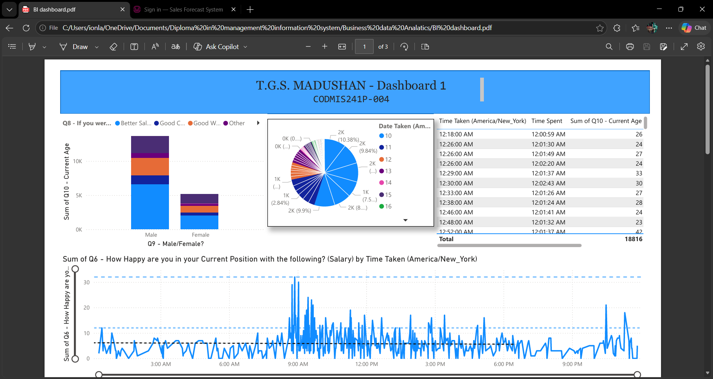
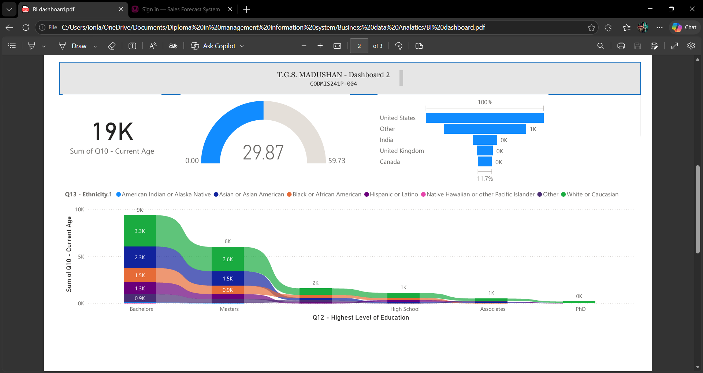
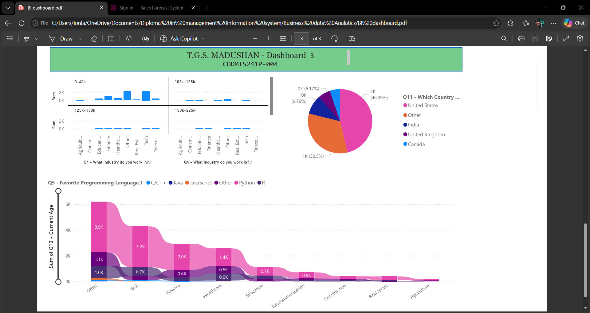

# 📊 Business Data Analytics Dashboard (Power BI)

## 📌 Project Overview
This project demonstrates a Power BI dashboard built using a business dataset to analyze performance and generate insights.

---

## 🛠 Tools Used
- Power BI  
- Excel  
- Power Query  

---

## 📈 Features
- Interactive dashboard with filters and slicers  
- KPI indicators for business performance  
- Data visualization using charts and graphs  
- Trend analysis for decision-making  

---

## 🔄 Process
1. Imported dataset from Excel  
2. Cleaned and transformed data using Power Query  
3. Built dashboard with visuals and KPIs  

---

## 📷 Dashboard Preview

  
  
  

---

## 📁 Files Included
- Dataset (Excel)  
- Dashboard (PDF)  
- Dashboard screenshots  

---

## 🚀 Key Outcome
The dashboard enables better understanding of business performance through interactive visual insights and supports data-driven decision-making.
